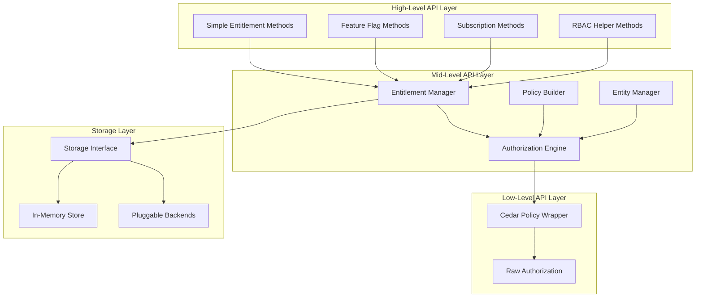

# GoEntitlement API Specification

## Overview

GoEntitlement is a general-purpose authorization library for Go that supports multiple entitlement patterns including RBAC (Role-Based Access Control), ABAC (Attribute-Based Access Control), feature flags, and subscription management. The library is built on top of Cedar Policy and provides multiple API layers for different use cases.

## Architecture



## Core Data Structures

### Principal

Represents an entity that can be granted entitlements (users, services, roles).

```go
type PrincipalType string

const (
    PrincipalTypeUser    PrincipalType = "user"
    PrincipalTypeService PrincipalType = "service"
    PrincipalTypeRole    PrincipalType = "role"
    PrincipalTypeGroup   PrincipalType = "group"
)

type Principal struct {
    ID         string                 `json:"id"`
    Type       PrincipalType          `json:"type"`
    Attributes map[string]interface{} `json:"attributes"`
    Groups     []string               `json:"groups"`
    CreatedAt  time.Time              `json:"created_at"`
    UpdatedAt  time.Time              `json:"updated_at"`
}
```

### Resource

Represents something that can be accessed or acted upon.

```go
type ResourceType string

const (
    ResourceTypeDocument   ResourceType = "document"
    ResourceTypeAPI        ResourceType = "api"
    ResourceTypeFeature    ResourceType = "feature"
    ResourceTypeSubscription ResourceType = "subscription"
    ResourceTypeCustom     ResourceType = "custom"
)

type Resource struct {
    ID         string                 `json:"id"`
    Type       ResourceType           `json:"type"`
    Attributes map[string]interface{} `json:"attributes"`
    Owner      *Principal             `json:"owner,omitempty"`
    CreatedAt  time.Time              `json:"created_at"`
    UpdatedAt  time.Time              `json:"updated_at"`
}
```

### Entitlement

Represents a specific permission or capability.

```go
type EntitlementType string

const (
    EntitlementTypePermission   EntitlementType = "permission"
    EntitlementTypeFeatureFlag  EntitlementType = "feature_flag"
    EntitlementTypeSubscription EntitlementType = "subscription"
    EntitlementTypeRole         EntitlementType = "role"
)

type Entitlement struct {
    ID          string                 `json:"id"`
    Type        EntitlementType        `json:"type"`
    Principal   Principal              `json:"principal"`
    Resource    *Resource              `json:"resource,omitempty"`
    Action      string                 `json:"action"`
    Conditions  map[string]interface{} `json:"conditions,omitempty"`
    ExpiresAt   *time.Time             `json:"expires_at,omitempty"`
    CreatedAt   time.Time              `json:"created_at"`
    UpdatedAt   time.Time              `json:"updated_at"`
}
```

### Authorization Request/Result

```go
type AuthorizationRequest struct {
    Principal Principal              `json:"principal"`
    Action    string                 `json:"action"`
    Resource  Resource               `json:"resource"`
    Context   map[string]interface{} `json:"context,omitempty"`
}

type AuthorizationResult struct {
    Allowed   bool     `json:"allowed"`
    Reasons   []string `json:"reasons,omitempty"`
    Policies  []string `json:"policies,omitempty"`
    Duration  time.Duration `json:"duration"`
}
```

## High-Level API

### EntitlementManager Interface

The main entry point for the library.

```go
type EntitlementManager interface {
    // Simple authorization checks
    CheckPermission(ctx context.Context, principal Principal, action string, resource Resource) (bool, error)
    CanAccess(ctx context.Context, principalID, resourceID, action string) (bool, error)
    
    // Feature flag operations
    HasFeature(ctx context.Context, principal Principal, feature string) (bool, error)
    IsFeatureEnabled(ctx context.Context, principalID, feature string) (bool, error)
    EnableFeature(ctx context.Context, principalID, feature string, conditions map[string]interface{}) error
    DisableFeature(ctx context.Context, principalID, feature string) error
    
    // Subscription management
    HasSubscription(ctx context.Context, principal Principal, tier string) (bool, error)
    GetSubscriptionTier(ctx context.Context, principalID string) (string, error)
    SetSubscription(ctx context.Context, principalID, tier string, expiresAt *time.Time) error
    
    // RBAC helpers
    HasRole(ctx context.Context, principal Principal, role string) (bool, error)
    AssignRole(ctx context.Context, principalID, role string) error
    RemoveRole(ctx context.Context, principalID, role string) error
    GetRoles(ctx context.Context, principalID string) ([]string, error)
    
    // Entitlement management
    GrantEntitlement(ctx context.Context, entitlement Entitlement) error
    RevokeEntitlement(ctx context.Context, entitlementID string) error
    ListEntitlements(ctx context.Context, principal Principal) ([]Entitlement, error)
    
    // Batch operations
    CheckMultiplePermissions(ctx context.Context, requests []AuthorizationRequest) ([]AuthorizationResult, error)
    GrantMultipleEntitlements(ctx context.Context, entitlements []Entitlement) error
    
    // Low-level access
    RawAuthorize(ctx context.Context, req AuthorizationRequest) (AuthorizationResult, error)
}
```

### Factory Functions

```go
// NewManager creates a new EntitlementManager with default configuration
func NewManager(opts ...ManagerOption) EntitlementManager

// NewManagerWithStore creates a manager with a custom store
func NewManagerWithStore(store EntitlementStore, opts ...ManagerOption) EntitlementManager

// ManagerOption configures the EntitlementManager
type ManagerOption func(*ManagerConfig)

// WithPolicyDir sets the directory for policy files
func WithPolicyDir(dir string) ManagerOption

// WithCache enables caching with specified TTL
func WithCache(ttl time.Duration) ManagerOption

// WithAuditLogger enables audit logging
func WithAuditLogger(logger AuditLogger) ManagerOption

// WithMetrics enables metrics collection
func WithMetrics(collector MetricsCollector) ManagerOption
```

## Mid-Level API

### Entity Management

```go
type EntityManager interface {
    // Principal management
    CreatePrincipal(ctx context.Context, principal Principal) error
    GetPrincipal(ctx context.Context, id string) (Principal, error)
    UpdatePrincipal(ctx context.Context, principal Principal) error
    DeletePrincipal(ctx context.Context, id string) error
    ListPrincipals(ctx context.Context, filter PrincipalFilter) ([]Principal, error)
    
    // Resource management
    CreateResource(ctx context.Context, resource Resource) error
    GetResource(ctx context.Context, id string) (Resource, error)
    UpdateResource(ctx context.Context, resource Resource) error
    DeleteResource(ctx context.Context, id string) error
    ListResources(ctx context.Context, filter ResourceFilter) ([]Resource, error)
}

type PrincipalFilter struct {
    Type   *PrincipalType `json:"type,omitempty"`
    Groups []string       `json:"groups,omitempty"`
    Limit  int            `json:"limit,omitempty"`
    Offset int            `json:"offset,omitempty"`
}

type ResourceFilter struct {
    Type    *ResourceType `json:"type,omitempty"`
    OwnerID *string       `json:"owner_id,omitempty"`
    Limit   int           `json:"limit,omitempty"`
    Offset  int           `json:"offset,omitempty"`
}
```

### Policy Builder

```go
type PolicyBuilder interface {
    // Create policies programmatically
    NewPolicy(name string) PolicyBuilder
    
    // Set policy components
    WithPrincipal(principal string) PolicyBuilder
    WithAction(action string) PolicyBuilder
    WithResource(resource string) PolicyBuilder
    WithCondition(condition string) PolicyBuilder
    
    // Build the policy
    Build() (Policy, error)
    
    // Generate Cedar policy text
    ToCedar() (string, error)
}

type Policy struct {
    ID          string    `json:"id"`
    Name        string    `json:"name"`
    Description string    `json:"description"`
    Cedar       string    `json:"cedar"`
    CreatedAt   time.Time `json:"created_at"`
    UpdatedAt   time.Time `json:"updated_at"`
}
```

## Storage Interface

### EntitlementStore

```go
type EntitlementStore interface {
    // Policy storage
    SavePolicy(ctx context.Context, policy Policy) error
    GetPolicy(ctx context.Context, id string) (Policy, error)
    ListPolicies(ctx context.Context) ([]Policy, error)
    DeletePolicy(ctx context.Context, id string) error
    
    // Entity storage
    SavePrincipal(ctx context.Context, principal Principal) error
    GetPrincipal(ctx context.Context, id string) (Principal, error)
    SaveResource(ctx context.Context, resource Resource) error
    GetResource(ctx context.Context, id string) (Resource, error)
    
    // Entitlement storage
    SaveEntitlement(ctx context.Context, entitlement Entitlement) error
    GetEntitlement(ctx context.Context, id string) (Entitlement, error)
    GetEntitlements(ctx context.Context, principalID string) ([]Entitlement, error)
    DeleteEntitlement(ctx context.Context, id string) error
    
    // Batch operations
    SaveEntitlements(ctx context.Context, entitlements []Entitlement) error
    
    // Health and maintenance
    Health(ctx context.Context) error
    Close() error
}
```

### Built-in Store Implementations

```go
// NewInMemoryStore creates an in-memory store (default)
func NewInMemoryStore() EntitlementStore

// NewRedisStore creates a Redis-backed store
func NewRedisStore(addr, password string, db int) EntitlementStore

// NewPostgreSQLStore creates a PostgreSQL-backed store
func NewPostgreSQLStore(connectionString string) EntitlementStore

// NewFileStore creates a file-based store
func NewFileStore(directory string) EntitlementStore
```

## Low-Level API

### Direct Cedar Access

```go
type CedarEngine interface {
    // Direct Cedar policy operations
    AddCedarPolicy(ctx context.Context, policyID, cedar string) error
    RemoveCedarPolicy(ctx context.Context, policyID string) error
    
    // Direct entity operations
    AddCedarEntity(ctx context.Context, entity cedar.Entity) error
    RemoveCedarEntity(ctx context.Context, entityID cedar.EntityUID) error
    
    // Raw authorization
    Authorize(ctx context.Context, req cedar.Request) (cedar.Decision, error)
    
    // Schema management
    SetSchema(ctx context.Context, schema cedar.Schema) error
    ValidatePolicy(ctx context.Context, policy string) error
}
```

## Usage Examples

### Simple Permission Check

```go
package main

import (
    "context"
    "log"
    
    "github.com/benbenbenbenbenben/goentitlement"
)

func main() {
    // Create manager with default in-memory store
    manager := goentitlement.NewManager()
    
    // Define entities
    user := goentitlement.Principal{
        ID:   "user123",
        Type: goentitlement.PrincipalTypeUser,
        Attributes: map[string]interface{}{
            "department": "engineering",
        },
    }
    
    document := goentitlement.Resource{
        ID:   "doc456",
        Type: goentitlement.ResourceTypeDocument,
        Attributes: map[string]interface{}{
            "classification": "internal",
        },
    }
    
    // Check permission
    allowed, err := manager.CheckPermission(context.Background(), user, "read", document)
    if err != nil {
        log.Fatal(err)
    }
    
    if allowed {
        log.Println("User can read the document")
    } else {
        log.Println("Access denied")
    }
}
```

### Feature Flag Management

```go
// Enable a feature for a user
err := manager.EnableFeature(ctx, "user123", "premium_analytics", map[string]interface{}{
    "trial_expires": time.Now().Add(30 * 24 * time.Hour),
})

// Check if user has feature
hasFeature, err := manager.HasFeature(ctx, user, "premium_analytics")
```

### Subscription Management

```go
// Set user subscription
err := manager.SetSubscription(ctx, "user123", "premium", &expiryDate)

// Check subscription tier
tier, err := manager.GetSubscriptionTier(ctx, "user123")

// Check if user has specific subscription
hasPremium, err := manager.HasSubscription(ctx, user, "premium")
```

### Advanced Usage with Custom Store

```go
// Create manager with Redis store
redisStore := goentitlement.NewRedisStore("localhost:6379", "", 0)
manager := goentitlement.NewManagerWithStore(redisStore,
    goentitlement.WithCache(5*time.Minute),
    goentitlement.WithAuditLogger(auditLogger),
    goentitlement.WithPolicyDir("./policies"),
)

// Batch authorization checks
requests := []goentitlement.AuthorizationRequest{
    {Principal: user1, Action: "read", Resource: doc1},
    {Principal: user1, Action: "write", Resource: doc2},
    {Principal: user2, Action: "delete", Resource: doc3},
}

results, err := manager.CheckMultiplePermissions(ctx, requests)
```

### Policy Builder Usage

```go
// Create a policy programmatically
policy, err := goentitlement.NewPolicyBuilder().
    NewPolicy("engineering_access").
    WithPrincipal(`principal.department == "engineering"`).
    WithAction("read").
    WithResource(`resource.classification == "internal"`).
    Build()

// Convert to Cedar syntax
cedarText, err := policy.ToCedar()
```

## Error Handling

```go
// Define custom error types
type EntitlementError struct {
    Code    ErrorCode
    Message string
    Cause   error
}

type ErrorCode string

const (
    ErrorCodeNotFound        ErrorCode = "NOT_FOUND"
    ErrorCodeUnauthorized    ErrorCode = "UNAUTHORIZED"
    ErrorCodeInvalidInput    ErrorCode = "INVALID_INPUT"
    ErrorCodeStorageError    ErrorCode = "STORAGE_ERROR"
    ErrorCodePolicyError     ErrorCode = "POLICY_ERROR"
)
```

## Configuration

```go
type ManagerConfig struct {
    // Storage configuration
    Store            EntitlementStore
    PolicyDir        string
    
    // Performance settings
    CacheEnabled     bool
    CacheTTL         time.Duration
    MaxConcurrency   int
    
    // Observability
    AuditLogger      AuditLogger
    MetricsCollector MetricsCollector
    
    // Security
    EncryptionKey    []byte
    SigningKey       []byte
}

type AuditLogger interface {
    LogAuthorization(ctx context.Context, req AuthorizationRequest, result AuthorizationResult)
    LogEntitlementChange(ctx context.Context, change EntitlementChange)
}

type MetricsCollector interface {
    IncrementAuthorizationCount(allowed bool)
    RecordAuthorizationDuration(duration time.Duration)
    IncrementEntitlementCount(operation string)
}
```

## Performance Considerations

- **Caching**: Built-in caching layer for frequently accessed policies and entities
- **Batch Operations**: Support for bulk authorization checks and entitlement operations
- **Connection Pooling**: Efficient database connection management for external stores
- **Lazy Loading**: Entities and policies loaded on-demand
- **Concurrent Processing**: Safe for concurrent use with proper locking mechanisms

## Security Features

- **Audit Logging**: Comprehensive audit trail for all authorization decisions
- **Encryption**: Optional encryption for sensitive data in storage
- **Policy Validation**: Built-in validation for Cedar policies
- **Input Sanitization**: Protection against injection attacks
- **Rate Limiting**: Optional rate limiting for API calls

## Migration and Compatibility

- **Schema Versioning**: Support for schema evolution
- **Data Migration**: Tools for migrating between storage backends  
- **Backward Compatibility**: Maintained across minor version updates
- **Import/Export**: Tools for policy and entity backup/restore

This API specification provides a comprehensive foundation for implementing a flexible, performant, and secure entitlement library that can handle diverse authorization scenarios while maintaining simplicity for common use cases.